# STM32U5 AWS Virtual Workshop 2023

## 1- Introduction
Welcome to the STM32U5 AWS Virtual workshop.
To ensure that everything runs smoothly on the day of the workshop, it is recommended that you follow all installation steps before the workshop, ideally a week in advance.

This process may take between 15mn to 1 hours to complete depending on your system and Internet speed.

If you have any question or need support ahead of the workshop, please contact our support line. The details are provided at the end of this document.

## 2- Important
You need to have administration rights on your PC to be able to install drivers and software and to do the workshop.
Please refer to the **prerequisite check** [video](https://www.youtube.com/watch?v=lYosd59XIfs)
[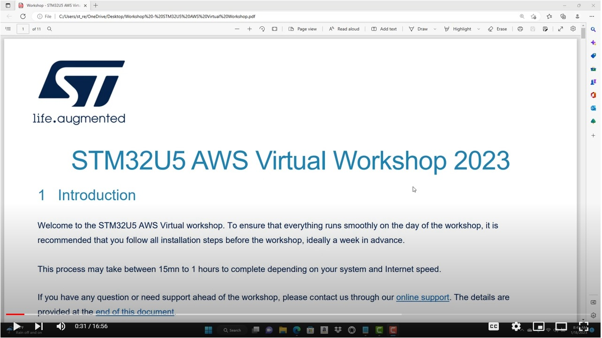](https://www.youtube.com/watch?v=lYosd59XIfs)

## 3- System requirements
You can use Windows, Linux, or Mac OS; however, we recommend that you use a Windows machine.
We recommend a fresh Windows install. If that is not possible, try to run Windows sandbox or a virtual machine.

## 4- Hardware Requirements
* 1 x [B-U585I-IOT02A](https://www.st.com/en/evaluation-tools/b-u585i-iot02a.html) board
* 1 x male Type-A to male Type-B micro-USB cable (not included in the kit)
* 2.4 GHz Wi-Fi router (No captive portal)

## 5- Minimum Recommended Hardware Requirements for PC
* Type A USB port
* 2+ GHz processor
* 4 GB of system memory (RAM)
* 10 GB of available disk space

Note: For machines with USB Type C, please have a Type A to Type C adapter

## 6- Software Requirements
You need to have administration rights on your Laptop Computer to be able to install drivers and software and to do the workshop. 

You can use Windows, Linux, or Mac OS; however, we recommend that you use a Windows machine with a fresh Windows install. If that is not possible, try to run Windows sandbox or a virtual machine. It will be hard for us to debug system issues remotely.

| Software                | Version   | Description                                                            |
| ----------------------- | --------- |----------------------------------------------------------------------- |
| Git                     |           | DevOps tool used for source code management                            |
| STM32CubeProgrammer     | 2.12.0    | All-in-one multi-OS software tool for programming STM32                |
| STM32CubeIDE            | 1.11.0    | An all-in-one multi-OS development tool                                |
| iot-reference-stm32u5   | 202212.00 | Integrate modular FreeRTOS kernel and libraries with hardware enforced security to build more secure updatable cloud connected applications |
| Python with Pip         | 3.11.1    | A general-purpose programming language                                 |
| PERL                    | 5.32.1    | A high-level general-purpose programming language                      |
| CMAKE                   | 3.25.1    | An extensible, open-source system that manages the build process       |
| AWSCLI                  | 2.9.14    | A tool that pulls all the AWS services together in one central console |
| Edge or Chrome          |           | Web browser                                                            |
| WebEx Application       |           | Used for live support during the day of the session you are registered. It will be used only when you have specific questions |


## 7- Prepare your system
To ensure that everything runs smoothly on the day of the workshop, it is recommended that you follow all installation steps before the workshop, ideally a week+ in advance. The procedure depends on the operating system and could take between 15mn to 1h to complete. 

Windows is recommended

For Windows, the system setup and check is automated by the [**STM32U5_AWS_VWS_PrereqCheck.ps1**](https://github.com/stm32-hotspot/STM32U5_AWS_Virtual_Workshop_2023/blob/main/STM32U5_AWS_VWS_PrereqCheck.ps1) script. Linux and Mac OS are manual setup.

### 7.1- System preparation procedure for Windows

The instructions on setting up your Windows machine are described in this video.

A video version of these steps can be found [here](https://github.com/stm32-hotspot/STM32U5_AWS_Virtual_Workshop_2023#10-video).

* Install Git

Download Git for your platform from the official [website](https://git-scm.com/downloads)


* Open **PowerShell**

Open PowerShell terminal as Administrator

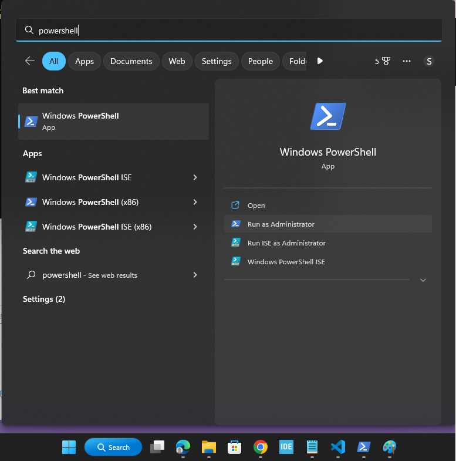


* Set execution policy

Run the following command to allow script execution

```
Set-ExecutionPolicy -ExecutionPolicy Unrestricted  -Scope CurrentUser
```
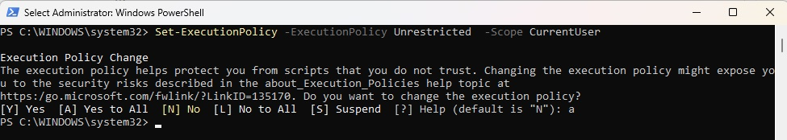


Enter **y** to accept the Execution Policy Change

* Navigate to your working

Navigate to the directory where you have cloned this repo to. 
```
cd C:\<Your directory>
```

* Clone the repo
```
git clone https://github.com/stm32-hotspot/STM32U5_AWS_Virtual_Workshop_2023.git
```

* Navigate to the workshop directory

Navigate to the directory where you have cloned this repo to. 
```
cd C:\<Your directory>\STM32U5_AWS_Virtual_Workshop_2023
```

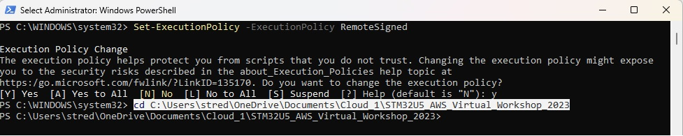

* Execute the script

Type .\STM32U5_AWS_VWS_PrereqCheck.ps1 to run the prerequisite check script

```
.\STM32U5_AWS_VWS_PrereqCheck.ps1
```

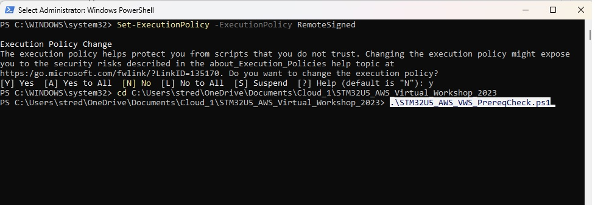

Here is the script flow
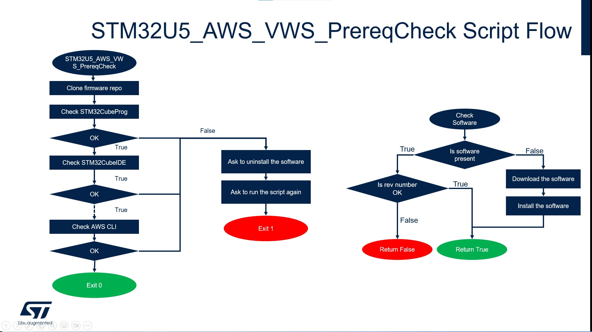

### 7.2- System preparation procedure for Linux

* Clone the repo
```
git clone https://github.com/stm32-hotspot/STM32U5_AWS_Virtual_Workshop_2023.git
```
* Install dependencies using your distribution's package manager

    * Debian based (.deb / apt)
```
sudo apt install build-essential cmake python3 git libncurses5 libusb-1.0-0-dev
```

* Redhat (.rpm / dnf / yum)

```
sudo dnf install -y cmake python3 git ncurses-libs libusb
sudo dnf groupinstall -y "Development Tools" "Development Libraries" --skip-broken
```

* Clone the iot-reference-stm32u5 repository and submodules
```
git clone https://github.com/FreeRTOS/iot-reference-stm32u5.git
git -C iot-reference-stm32u5 submodule update --init
```

* Install STM32CubeIDE

Download the latest version of STM32CubeIDE from the [STMicroelectronics website](https://www.st.com/en/development-tools/stm32cubeide.html).

Please refer to the [STM32CubeIDE Installation guide](https://www.st.com/resource/en/user_manual/um2563-stm32cubeide-installation-guide-stmicroelectronics.pdf) and the included instructions for your platform if additional help is needed.

* Install AWS CLI

Download AWS CLI for your platform from the official [website](https://aws.amazon.com/cli/)

### 7.3- System preparation procedure for Mac OS

* Clone the repo
```
git clone https://github.com/stm32-hotspot/STM32U5_AWS_Virtual_Workshop_2023.git
```

* With Homebrew package manager

Install the hombrew package manager from brew.sh
```
brew install python cmake git libusb greadlink coreutils
```

* Link GNU core utilities into system bin directory
```
sudo ln -s /usr/local/Cellar/coreutils/9.0_1/bin/realpath /usr/local/bin/realpath
sudo ln -s /usr/local/Cellar/coreutils/9.0_1/bin/readlink /usr/local/bin/readlink
```

* Clone the iot-reference-stm32u5 repository and submodules
```
git clone https://github.com/FreeRTOS/iot-reference-stm32u5.git
git -C iot-reference-stm32u5 submodule update --init
```


* Install STM32CubeIDE

Download the latest version of STM32CubeIDE from the [STMicroelectronics website](https://www.st.com/en/development-tools/stm32cubeide.html).

Please refer to the [STM32CubeIDE Installation guide](https://www.st.com/resource/en/user_manual/um2563-stm32cubeide-installation-guide-stmicroelectronics.pdf) and the included instructions for your platform if additional help is needed.

* Install AWS CLI

Download AWS CLI for your platform from the official [website](https://aws.amazon.com/cli/)

## 8- Wi-Fi Setup
You need a 2.4 GHz Wi-Fi to run the workshop as the Wi-Fi module on the  [B-U585I-IOT02A](https://www.st.com/en/evaluation-tools/b-u585i-iot02a.html) board supports 2.4 GHz Wi-Fi only. If you are not sure about your Wi-Fi settings, you can setup your PC as a 2.4 GHz hotspot and connect the board to it. To do that:
* On the search bar type hotspot 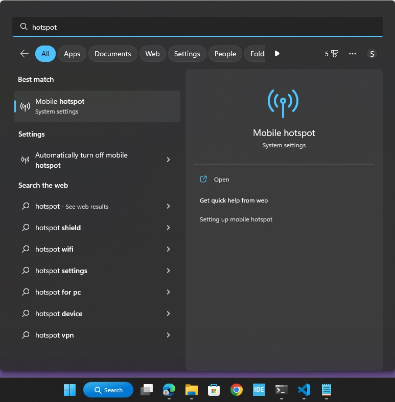
* Enable the hotspot 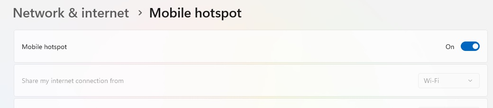
* Edit the hotspot properties 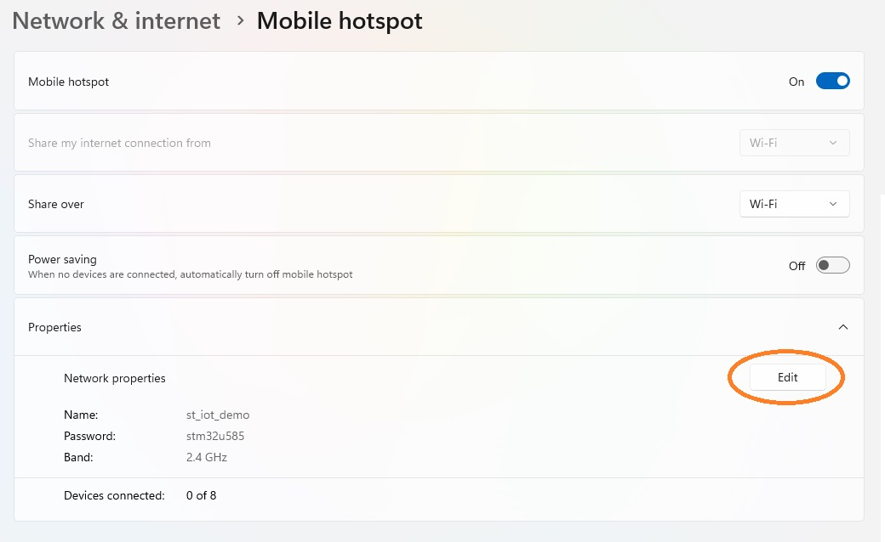
* Set the hotspot SSID, Password and Select the 2.4 GHz option  and click save 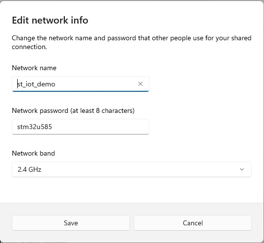
* Turn the power saving option off 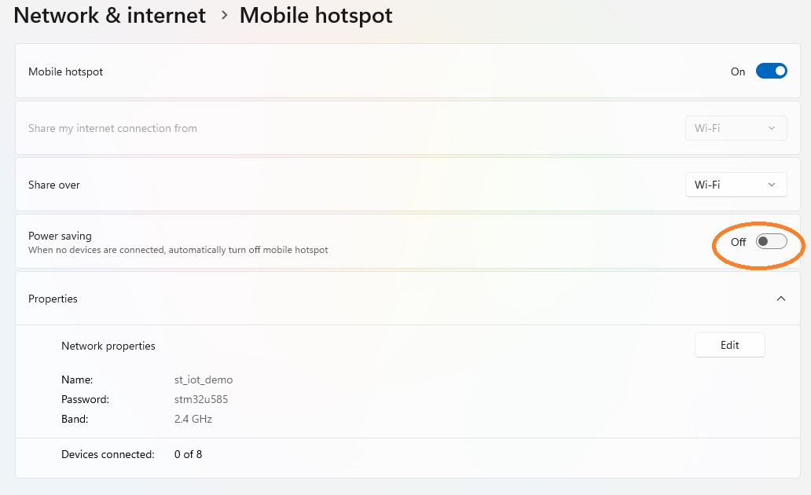


## 9- Support

Questions and support ahead of the workshop

-	If you have issues during the software download and install, please contact ST by entering an Online Support Request at: https://community.st.com/s/onlinesupport?o=ws&tabset-08cae=2 
to help resolve the issue.

-	When entering the support request, in the Subject field please fill with: “STM32U5 AWS Virtual workshop”.

To ensure your request is quickly routed to the correct support team, please indicate the Workshop Request Type, Technical or Non-Technical, that best describes your question.

## [10 Video](https://youtu.be/lYosd59XIfs)
The prerequisite check video
[](https://www.youtube.com/watch?v=lYosd59XIfs)